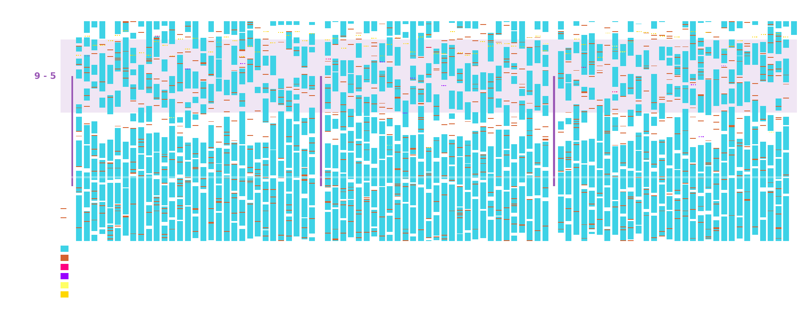

# BabySleepViz

[](https://github.com/gototen/baby-sleep-viz/actions/workflows/test.yml)

Visualize baby sleep, feeding, and medication patterns from tracking app exports.

Transform your baby tracking app data into beautiful heatmap visualizations that reveal sleep patterns, feeding schedules, and medication timing over weeks or months.



## Features

- **Sleep pattern visualization** - See how sleep consolidates from newborn to toddler
- **Feeding overlay** - Track feeding frequency and timing
- **Medication tracking** - Visualize medications with distinct colors
- **Age-aligned month boundaries** - Automatic month labels based on birthday
- **App-agnostic** - Works with any baby tracking app via configurable CSV parsing
- **Privacy-focused** - Your data stays local; sample data included for demos

## Supported Apps

BabySleepViz can work with exports from any baby tracking app. It comes with built-in support for:

- **Huckleberry** - Full configuration included (`configs/huckleberry.yaml`)

Adding support for other apps is easy - just create a YAML config file that maps your app's CSV columns. See [Adding New Data Sources](#adding-support-for-other-apps).

## Installation

### From source

```bash
git clone https://github.com/gototen/baby-sleep-viz.git
cd baby-sleep-viz
pip install -e .
```

### Dependencies only

```bash
pip install -r requirements.txt
```

## Quick Start

### Using sample data

The `local/` folder contains sample data files showing the expected format:

```bash
# Generate visualization from included sample data (one command!)
babysleepviz local/sample_huckleberry.csv --day-zero 2024-01-01 -o local/output.png
```

### Using your own data

1. **Export your data from your tracking app:**
   - Most apps have a "Export" or "Backup" option in Settings
   - Choose CSV format if available
   - Save or email the file to yourself

   **For Huckleberry:**
   - Open Huckleberry app and put in a support request for your childs sleep data as a CSV file. They usually email it in a day or so.

2. **Save your export to the `local/` folder** (your personal files are gitignored):
   ```bash
   mv ~/Downloads/my_export.csv local/
   ```

3. **Generate your visualization:**

```bash
# Replace YYYY-MM-DD with baby's birthday (or first day of data)
babysleepviz local/my_export.csv --day-zero 2024-01-15 -o local/my_visualization.png

# With additional options:
babysleepviz local/my_export.csv \
    --day-zero 2024-01-15 \
    --birthday-day 15 \
    --max-months 12 \
    -o local/my_visualization.png
```

## Command Line Interface

### babysleepviz (Main Command)

The main command parses your tracking app CSV and generates the visualization in one step:

```
babysleepviz <input.csv> --day-zero YYYY-MM-DD [options]

Required:
  input                 Input CSV file from baby tracking app
  --day-zero            Start date (usually baby's birthday) in YYYY-MM-DD format

Options:
  -o, --output          Output PNG file (default: local/heatmap.png)
  -c, --config          Config file path (default: configs/huckleberry.yaml)
  --birthday-day        Day of month for birthday alignment (default: 1)
  --max-months          Maximum months to display (default: 24)
  --day-start-hour      Hour that starts each "day" (default: 7 = 7:00 AM)
  --bucket-minutes      Time bucket size in minutes (default: 5)
  --save-buckets        Optional: save intermediate bucketed data to this CSV path
```

### Advanced Commands

For debugging or custom workflows, you can run the parse and render steps separately:

#### babysleepviz-parse

Parse tracking app CSV into time-bucketed data:

```
babysleepviz-parse <input.csv> -o <output.csv> [options]

Options:
  -o, --output          Output CSV file (default: local/buckets.csv)
  -c, --config          Config file path (default: configs/huckleberry.yaml)
  --day-start-hour      Hour that starts each "day" (default: 7)
  --bucket-minutes      Time bucket size in minutes (default: 5)
```

#### babysleepviz-render

Render bucketed data to PNG visualization:

```
babysleepviz-render <buckets.csv> --day-zero YYYY-MM-DD [options]

Options:
  -o, --output          Output PNG file (default: local/heatmap.png)
  --day-zero            Start date for day 0 (YYYY-MM-DD format, required)
  --birthday-day        Day of month for birthday alignment (default: 1)
  --max-months          Maximum months to display (default: 24)
  --day-start-hour      Hour that starts each "day" (default: 7)
```

## Understanding the Visualization

The heatmap shows time of day (vertical, 7am to 7am) vs days (horizontal, left to right):

- **Cyan blocks** = Sleep periods
- **Orange blocks** = Feeding events  
- **Colored dots** = Medications (each type has a distinct color)
- **Purple band** = 9am-5pm working hours overlay
- **White line** = Midnight marker
- **Purple vertical lines** = Month boundaries (aligned to birthday)

### Reading patterns

- Early months show fragmented sleep with many short segments
- As babies age, sleep consolidates into longer nighttime blocks and fewer naps
- Feeding frequency typically decreases over time
- Night wakings appear as gaps in the overnight sleep blocks

## Configuration

### Data source configs

Configuration files define how to parse CSV exports from different apps. The included `configs/huckleberry.yaml` works with Huckleberry app exports:

```yaml
name: huckleberry
description: "Huckleberry baby tracking app"

columns:
  type: Type
  start: Start
  end: End

event_types:
  sleep: sleep
  feed: feed
  meds: meds

med_name_column: Start Location

medication_types:
  - Tylenol
  - Motrin
  - Vitamin D
  # ... add your medications
```

### Adding support for other apps

1. Export sample data from your tracking app (CSV format)
2. Copy `configs/huckleberry.yaml` to `configs/your_app.yaml`
3. Update column names to match your CSV headers
4. Update event type values to match your app's naming
5. Use `--config configs/your_app.yaml` when running

Example for a hypothetical app:

```yaml
name: baby_tracker_pro
description: "Baby Tracker Pro app"

columns:
  type: EventType
  start: StartTime
  end: EndTime

event_types:
  sleep: SLEEP
  feed: FEEDING
  meds: MEDICINE

med_name_column: MedicineName
```

## Generating Sample Data

To create synthetic test data (useful for testing or demos):

```bash
python scripts/generate_sample_data.py --days 90 --output local/sample_huckleberry.csv
```

Options:
- `--days N` - Number of days to generate (default: 90)
- `--start-date YYYY-MM-DD` - Start date (default: 2024-01-01)
- `--seed N` - Random seed for reproducibility

## Development

### Running tests

```bash
pip install -e ".[dev]"
pytest tests/ -v
```

### Code style

```bash
ruff check src/ tests/
ruff format src/ tests/
```

## Project Structure

```
baby-sleep-viz/
├── src/babysleepviz/           # Main package
│   ├── parse_data.py           # CSV parsing to time buckets
│   ├── visualize.py            # Heatmap generation
│   └── cli.py                  # CLI entrypoints (babysleepviz, -parse, -render)
├── configs/                    # Data source configurations
│   └── huckleberry.yaml        # Built-in Huckleberry support
├── local/                      # Working directory for data
│   ├── sample_huckleberry.csv  # Sample input (committed)
│   ├── sample_buckets.csv      # Sample output (committed)
│   └── (your files here)       # Your personal files (gitignored)
├── examples/                   # Example visualization outputs
├── scripts/                    # Utility scripts
├── tests/                      # Test suite
├── sleep_buckets.py            # Standalone script (parse only)
└── visualize_heatmap.py        # Standalone script (render only)
```

## Privacy Note

This tool processes baby tracking data locally on your machine. No data is sent anywhere. The included sample data is synthetically generated and contains no real information.

**Keep your data private:**
- The `local/` folder contains sample files showing the expected format
- Your personal files in `local/` are automatically gitignored (only `sample_*.csv` files are committed)
- Use the sample data as a reference for your own files

## License

MIT License - see [LICENSE](LICENSE) file.

## Contributing

Contributions welcome! Especially:
- **New app configs** - Add support for other baby tracking apps
- **Bug fixes** - Report issues or submit fixes
- **Documentation** - Improve setup guides for specific apps

See [CONTRIBUTING.md](CONTRIBUTING.md) for detailed guidelines.
